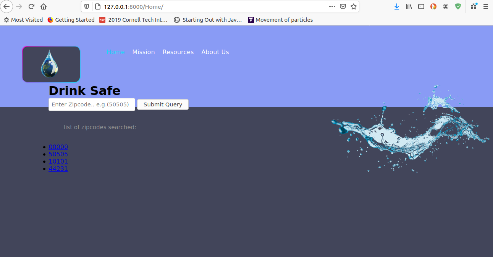

# WaterQuality

This is a python3 Django web framework application for checking
local water quality information

**Time spent**: over 20

**Dependencies**:
- Django

## Current Look:

## Functionality

**Display**
- [x] User able to interact with submission of zipcodes to local database
- [x] Homepage loaded and implemented
- [x] dynamically updates zipcodes

## Video Walkthrough

https://www.youtube.com/watch?v=Xe6t4T4O2NQ
